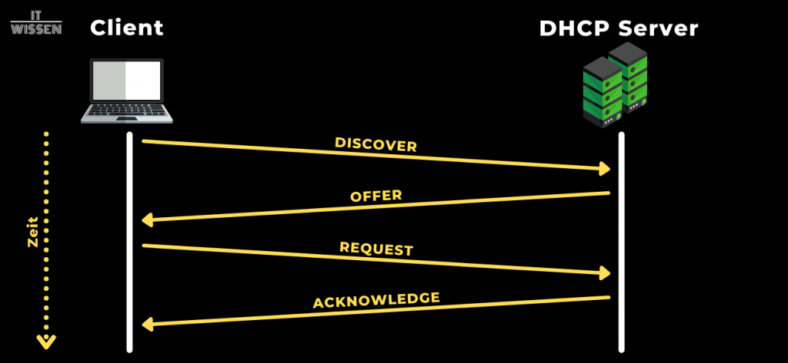

# DHCP

DHCP (_Dynamic Host Configuration Protocol_) wird für die automatische IP-Netzwerkkonfiguration von Clients eingesetzt. Man erspart sich hiermit das manuelle, statische Hinterlegen von IP-Adressen auf den einzelnen Clients.

## Vorteile

- weniger Aufwand beim Konfigurieren von **vielen** Clients
- Fremde Clients können eine Adresse erhalten, ohne diese extra im System zu hinterlegen
- IP-Adresse wird nur bei Betrieb des Clients blockiert und nach Ablauf der TTL wieder freigegeben

## Grundkonzept

Man benötigt einen DHCP-Server, welcher die folgenden Aufgaben übernimmt:

- Definition des Netzes bzw. der Menge von IP-Adressen, welche vergeben werden sollen
- Zuweisung der IPs an die Clients
- Verwaltung der freien und vergebenen IPs

## DHCP-Phasen

1. Client schickt `DHCPDISCOVER`:
   - MAC-Adresse
   - Quell-IP: `0.0.0.0`
   - Ziel-IP: `255.255.255.255` --> Broadcast
2. DHCP-Server antworten mit `DHCPOFFER`:
   - Vorschläge für mögliche IP-Adressen
   - Ziel-IP: `255.255.255.255` --> Broadcast
3. Client wählt ein Angebot aus (z.B. längster Lease, erstes Angebot, spezielle Konfiguration (Stichwort: DHCP-Options))
4. Client schickt `DHCPREQUEST`:
   - Ziel-IP: `255.255.255.255` --> Broadcast
   - Paket enthält Serveridentifier, damit der richtige Server die Nachricht erhält
5. Server bestätigt mit `DHCPACK` (_Acknowledged_) oder lehnt ab mit `DHCPNAK`
6. Client überprüft die erhaltene IP mittels ARP-Request im Netzwerk. Bei Antwort eines anderen Hosts schickt der Client ein `DHCPDECLINE`

