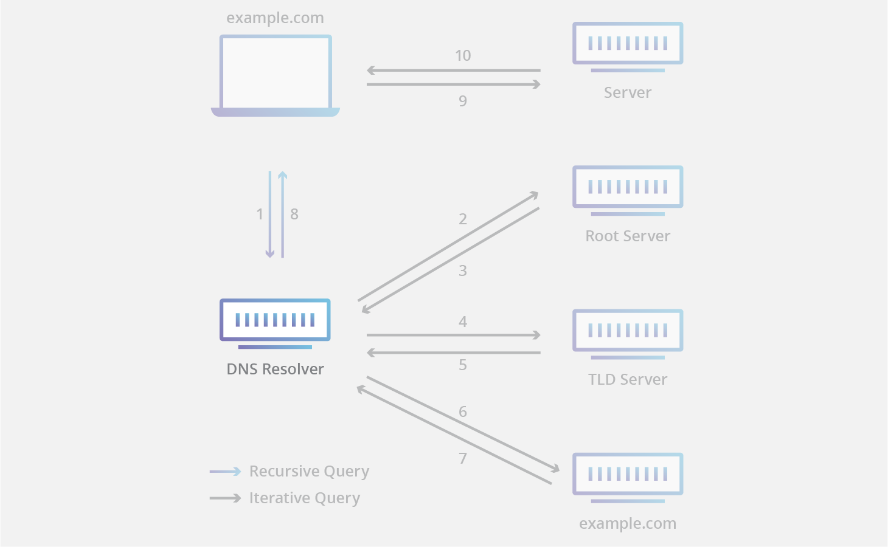

# DNS

DNS (_Domain Name System_) ist für die Auflösung von Domains in IP-Adressen zuständig.

## Organisatorische Regelung

Die Verwaltung der Domains wird zunächst durch die IANA (_Internet Assigned Numbers Authority_) geregelt. Diese teilt TLD-Server in zwei Hauptgruppen ein:

- Mit Ländercode: .de, .uk, .us, ...
- Ohne Ländercode: .com, .org, .gov, ...

Pro TLD gibt es eine weitere Instanz: Die DENIC eG verwaltet und vergibt alle .de-Domains.

## Ablauf

1. Client schaut zunächst nach Einträgen in der lokalen Hosts-Datei bzw. im Cache.
2. Anfrage des (lokalen) DNS-Resolvers
3. Anfrage an Root-Server (13 Stück)
   - Antwortet mit .tld-Server-IP
4. Anfrage an .tld-Server (z.B. \*.com)
   - Antwortet mit Authoritativer-Server-IP für Domain-Zone
5. Anfrage an Delegate-Server
   - Antwortet mit IP-Adresse

## DNS-Record-Types

- A: IPv4
- AAAA: IPv6
- MX: Mailserver
- [...usw](https://www.wikiwand.com/en/List_of_DNS_record_types)
