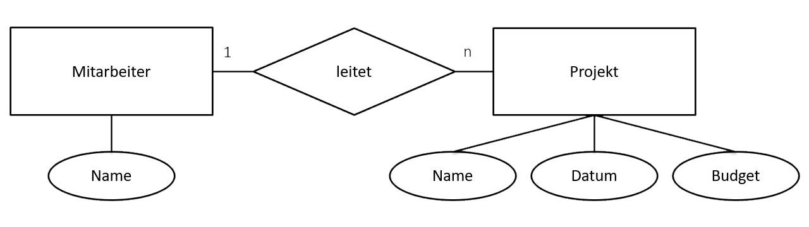

# ER-Modell & Relationenschema

## ER-Modell

- Ecken wie "Arbeitet in", "Arbeitet mit", usw. nicht vergessen!
- Kardinalitäten
- Attribute

## Relationenschema

Beispiel:

Mitarbeiter(<u>MitarbeiterID</u>) INT, Vorname VARCHAR(255), Nachname TEXT, Alter INT, Abteilung_ID INT)

Abteilung(<u>AbteilungID</u> INT, Bezeichnung VARCHAR(255))

[Überführung ERM in Relationenschema: YouTube](https://www.youtube.com/watch?v=EpO29jViDqw)
